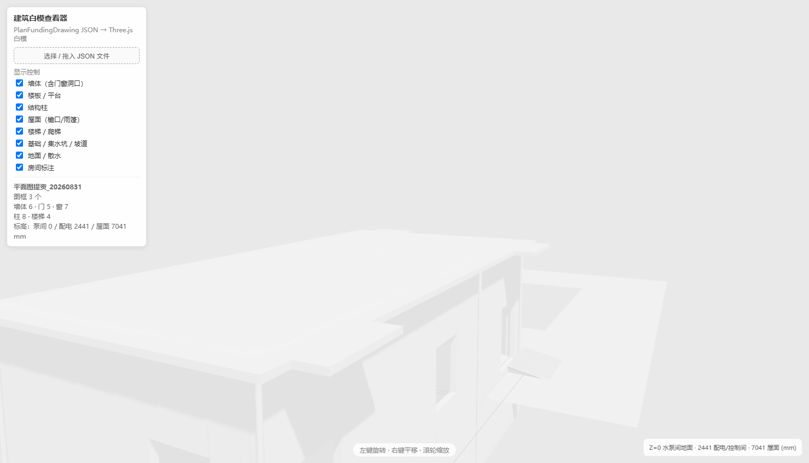

# 建筑白模查看器（PlanFundingDrawing JSON → Three.js）

把 CAD 插件导出的 `PlanFundingDrawing` JSON 在浏览器中生成可交互浏览的建筑白模。



## 直接使用

双击打开 `index.html` 即可（已内置示例数据，无需服务器）。

也可以把任意 JSON 拖进页面，或点击“选择 / 拖入 JSON 文件”加载：
- 文件通过本地读取，不会上传到任何服务器；
- 页面内置一份示例 JSON（`data/sample.json` 的同名副本），可直接体验。

## 操作

- 左键拖拽：旋转视角
- 右键拖拽：平移
- 滚轮：缩放
- 左侧面板：按构件类型显示/隐藏（墙体、楼板、柱、屋面、楼梯、基础、地面、标注）

## 已实现的建模逻辑（对应 JSON 图元）

| JSON 图元 | 白模处理 |
| --- | --- |
| `WallObject` | 矩形轮廓墙体；外墙/内墙按标高起止；门、窗洞口按“沿墙区间 + 高度区间”切割墙体（参数化拆板，不用布尔运算） |
| `DoorObject` / `WindowObject` | 在墙体上开洞；门高 2400、窗台高 900（可改常量）；洞口所在楼面按房间/检修平台区域自动判断 |
| `StructuralColumnObject` | 结构柱（全高） |
| `PlanElevationAnnotationObject` | 读取标高生成层高体系：水泵间 0 / 配电控制间 2441 / 室外 2141 / 屋面 7041 mm |
| `StairObject` / `SteelStairObject` / `SteelStairPlatformObject` / `SteelLadderObject` | 参数化楼梯、钢梯、钢爬梯 |
| `RoomOutlineObject` / `MaintenancePlatformObject` | 房间轮廓线 + 文字标注 |
| `RampObject` / `ApronObject` | 室外坡道（找坡）、散水范围 |
| `SumpPitObject` / `PumpFoundationObject` | 集水坑（下沉坑）、设备基础 |
| `RoofPolylineObject` / `RoofRainPipeObject` | 屋面（含挑檐、雨篷）、雨水管 |

三个图框（水泵间/配电间/屋面）通过轴线 1/A 对齐到同一建筑坐标系；重复图元（水泵间图框与配电间图框的重叠墙、柱）自动去重。

## 本地开发 / 自动化截图

静态服务方式：

```bash
python -m http.server 8123
# 打开 http://localhost:8123/white-model-viewer/
```

无头截图（需要本机 Chrome，Node 22+）：

```bash
node tools/cdp-shot.mjs "http://localhost:8123/white-model-viewer/?static=1" out.png 8
```

`?static=1` 会让页面在模型构建完成后渲染数帧即停止，方便稳定截图。

## 文件结构

```text
white-model-viewer/
  index.html        页面（含内嵌示例 JSON）
  js/white-model.js 解析 + 建模 + 渲染逻辑
  lib/              three.js r128 + OrbitControls（本地依赖，离线可用）
  data/sample.json  示例 JSON 副本
  tools/cdp-shot.mjs CDP 无头截图脚本
```
